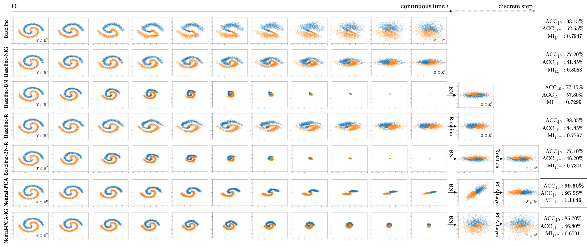
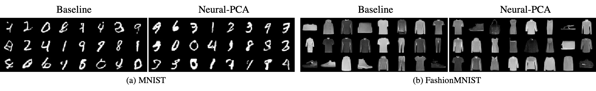

# Neural-PCA

This repository contains the PyTorch implementation of Neural-PCA proposed in the IJCAI2022 paper: 

Shen Li, Bryan Hooi. [Neural PCA for Flow-Based Representation Learning](https://arxiv.org/abs/2208.10753). IJCAI2022

<p align="center">
   
</p>

## Empirical Results
Neural-PCA provides better architectural inductive bias for normalizing flow, which leads to better data representation without compromising generative performance.

<p align="center">
   
</p>

## Requirements
* python==3.6.0
* torch==1.6.0
* torchvision==0.7.0
* tensorboard==2.4.0

## Getting Started
### Training


## Citation
```
@article{li2022neural,
  title={Neural PCA for Flow-Based Representation Learning},
  author={Li, Shen and Hooi, Bryan},
  journal={IJCAI 2022},
  year={2022}
}
```
